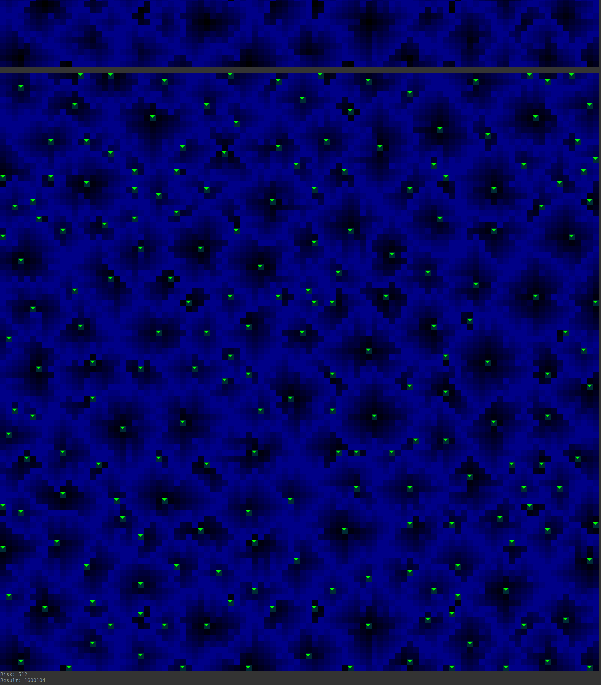

# Advent of code 2021

Introducing my entries for advent of code 2021, written in Rust. To run an assignment:

```Shell
cargo run --bin <assignment>
```

And to run a unit test (contianing sample code):

```Shell
cargo test --bin <assignment>
```

## Day 5


## Day 8


## Day 9


